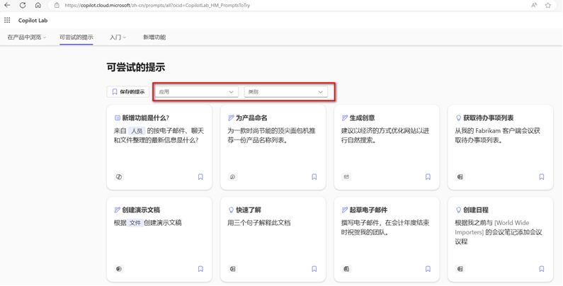
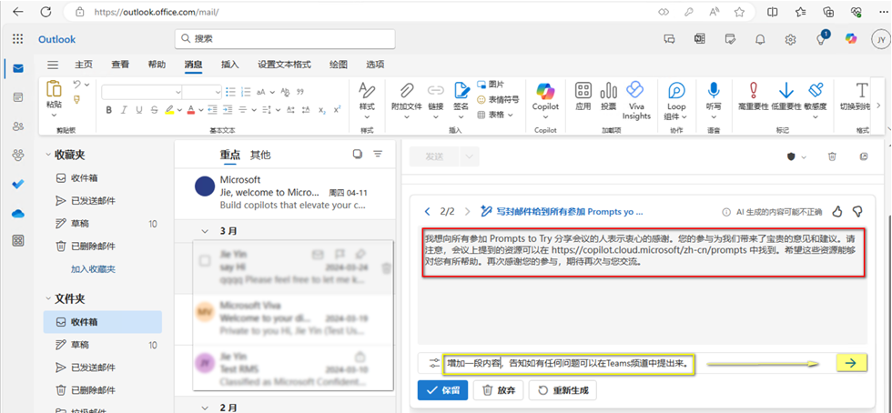
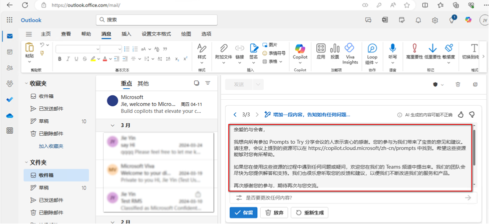
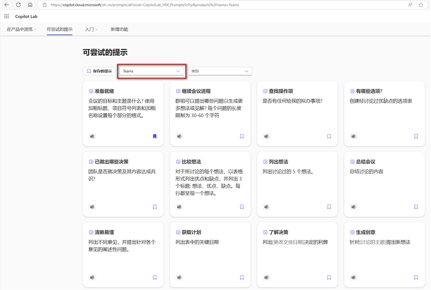
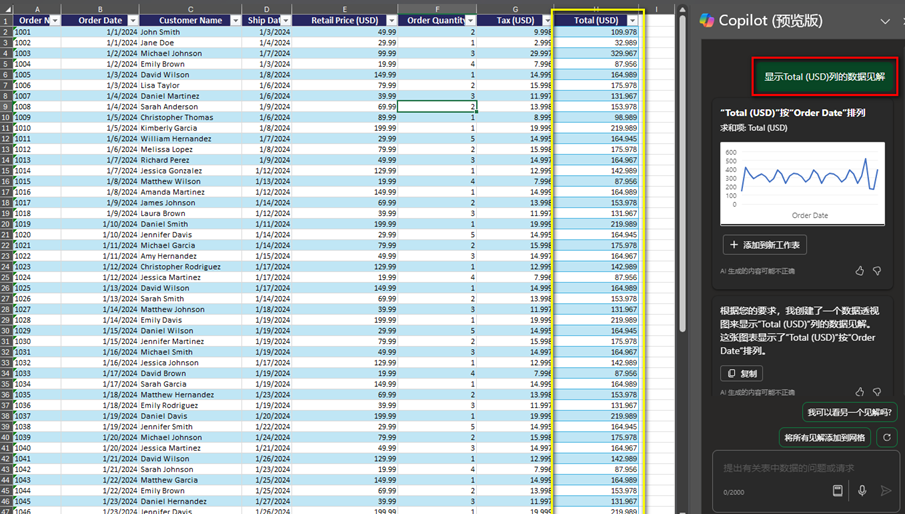
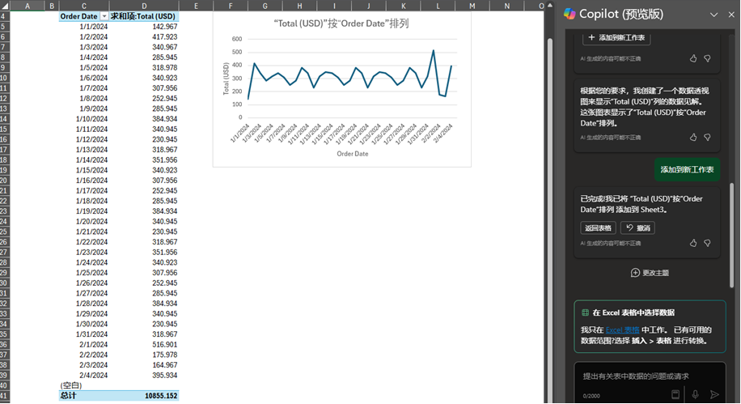

# 在吗？玩转M365，尽在Copilot！

## 引言
 
你是否经常会收到某些朋友的 “在吗”，Copilot也一样。作为一个能够显著提升生产力的工具，Copilot在面对这种无效对话的Prompts（提示词）的时候，也是空有一身本领施展不出。
 
当你想要利用Copilot做些什么，但却不知道该问它什么？或者压根不知道它能做到什么？如果你有这几个为什么，那你一定要了解一下这个网站：
https://copilot.cloud.microsoft/en-US/prompts/all?ocid=CopilotLab_HM_PromptsToTry

## Prompts to Try

这是一个专门为M365用户提供Copilot提示词的网站，它可以帮助你发现和使用各种应用中的Copilot功能。你可以根据应用和类别筛选你感兴趣的Prompts，比如说你可以找到Outlook中的邮件写作提示，Teams中的会议记录提示，Excel中的数据分析提示等等。这些提示都是由Copilot的专家团队精心设计和测试的，可以帮助提高你的Copilot使用效率和质量。
 
下面，我将以Outlook, Teams和Excel三个应用为例，和大家一起看看如何使用对应的Prompts。

## Demo
 
### Outlook:如何写出优雅而专业的邮件？
 
Outlook是我们日常工作中最常用的沟通工具之一，Copilot在Outlook中主要可以总结邮件和起草邮件, 网站中有如下Prompts供我们参考使用：

想象一个场景：你组织了一场关于Prompts to Try的分享会，会后需要发送邮件给与会者表示感谢。此时，我们可以借助“起草电子邮件“功能，来帮助我们用恰当的语言表达我们的意思。
 
在Outlook中，新建一封邮件并选择使用Copilot撰写草稿：

你只需要在输入框中输入大概的需求，点击生成即可帮你生成一封相对完整的邮件：

运行完一个Prompt之后，查看红色框中的结果，你还可以继续在黄色框中输入补充的Prompt，点击右侧的箭头继续完善你的结果直到满意为止：

之后点击保留生成草稿邮件。

你无需担心写作结构，只需提供大致的框架内容，我们将为您打造一封优雅而专业的邮件。

### Teams: 如何得到清晰的会议摘要？

Teams是我们日常工作中最常用的协作工具之一，Copilot在Teams中主要帮我们处理团队消息和会议内容。有如下的Prompts供我们参考使用：

考虑这样一个场景：你错过了一场会议，但是你想快速知道该会议的概要。此时，我们可以借助 “总结会议” 提示词，帮我们快速抓住会议主题和重点。需要注意的是， Copilot功能的使用需要会议开启文字或音频记录。

对于一个已经结束的会议，点击右上角的Copilot，在对话框中输入“总结讨论的内容”，Copilot会帮你小结该会议的概要信息。
 

此时，除了了解会议概要之外，我还会担心会议中是否提到了需要我后续跟进的内容，此时我们可以通过“查找操作项”来帮我列出后续需要做的事项。

在对话框中输入“是否有任何给我的拟办事项”，即可获取你的待办事项：

通过上述提示词，即使错过会议也无需担心，Copilot能让你在几分钟内快速清晰地了解会议内容，并知悉自己的会议任务。

### Excel: 如何通过自然语言完成简洁而有说服力的数据分析?

Excel是我们日常工作中最常用的数据处理工具之一，Copilot在Excel中可以帮助我们在不用了解那些复杂公式的情况下，以自然语言对各种数据进行整理，分析，可视化，报告等操作。有如下的Prompts供我们参考使用：
 

考虑这样一个场景：你收到一份来自不同客户的订单及交易数据，需要快速对其做分析处理。此时我们可以借助“查找见解”来让Copilot帮助我们去做数据分析：
 

想要看到订单成交量Total (USD) 的分析，我们可以直接输入“显示Total (USD)列的数据见解”。Copilot会自动分析这列信息和表内其他数据相互关联的内容。在我们的示例中，Copilot自动将总订单成交量Total (USD) 随订单日期的变化以图标的方式直观展示出来。同个Order Date的不同客户的订单也是按我们实际目的去合并计数。

从响应结果中也可以看到“添加到新工作表”按钮，点击之后，对应的分析数据会以更加详细的内容展示到单独的表格中

我们可以根据具体情况，选择一个或多个提示，或者修改一些细节，更加简单高效地来完成我们的数据分析内容。
  
以上，就是我今天要和大家分享的Prompts to Try网站中冰山一角的内容，还有很多的应用和相关prompts使用等待大家亲自去探索，拥有它可以让你更好地利用Copilot来提高自己的生产力，快去试试吧！
